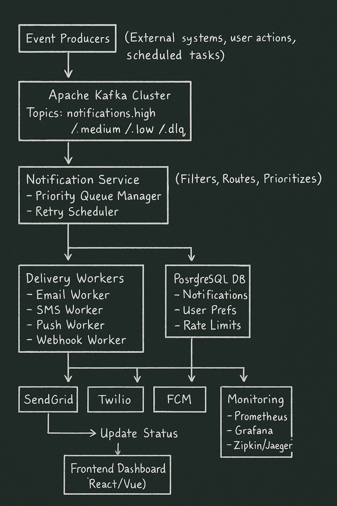

# Real-time Event-Driven Notification System

A production-ready, scalable microservices-based notification system built with Spring Boot, Apache Kafka, and Redis. Designed to handle high-volume notification delivery across multiple channels (Email, SMS, Push, Webhook) with advanced features like priority queuing, rate limiting, and real-time monitoring.

## 🏗️ Architecture Overview



### System Components

- **Event Ingestion Service** (Port 8081): Receives and validates notification requests with API documentation
- **Notification Processing Service** (Port 8082): Processes events, applies business logic, manages priorities and retries
- **Delivery Service** (Port 8083): Handles multi-channel notification delivery with external service integrations

### Detailed Architecture

For a comprehensive architecture diagram and component descriptions, see [Architecture Documentation](docs/architecture.md).

**Key Features:**
- 🚀 High-throughput event processing with Apache Kafka
- 📊 Priority-based message queuing (High/Medium/Low/DLQ)
- 🔄 Automatic retry with exponential backoff
- 💾 Persistent storage with PostgreSQL
- ⚡ Redis caching for performance
- 📈 Monitoring with Prometheus, Grafana, and distributed tracing
- 🌐 Real-time updates via WebSocket
- 🔒 Rate limiting and idempotency protection

## 🛠️ Technology Stack

### Backend
- **Java 17** - Modern Java features and performance
- **Spring Boot 3.2** - Microservices framework
- **Apache Kafka** - Distributed event streaming (3-node cluster)
- **PostgreSQL** - Relational database for persistent storage
- **Redis** - In-memory cache and rate limiting

### Infrastructure
- **Docker & Docker Compose** - Containerization and orchestration
- **Kafka UI** - Web interface for Kafka monitoring
- **SendGrid** - Email delivery service
- **Twilio** - SMS delivery service
- **Firebase Cloud Messaging (FCM)** - Push notifications

### Monitoring & Observability
- **Prometheus** - Metrics collection
- **Grafana** - Visualization and dashboards
- **Zipkin/Jaeger** - Distributed tracing

### Frontend
- **React/Vue.js** - Real-time dashboard with WebSocket

## 🚀 Getting Started

### Prerequisites

- **Java 17+** - [Download](https://adoptium.net/)
- **Docker & Docker Compose** - [Download](https://www.docker.com/products/docker-desktop)
- **Maven 3.8+** - [Download](https://maven.apache.org/download.cgi)

### Quick Start

#### 1. Clone the Repository
```bash
git clone https://github.com/HYyydu/DistributedSystem.git
cd DistributedSystem
```

#### 2. Start Infrastructure (Kafka, PostgreSQL, Redis)
```bash
docker-compose up -d
```

Wait for services to be ready (about 30 seconds). You can check status with:
```bash
docker-compose ps
```

#### 3. Run Microservices

**Terminal 1: Event Ingestion Service**
```bash
cd services/event-ingestion-service
mvn spring-boot:run
```

**Terminal 2: Notification Processing Service**
```bash
cd services/notification-processing-service
mvn spring-boot:run
```

**Terminal 3: Delivery Service**
```bash
cd services/notification-delivery-service
mvn spring-boot:run
```

#### 4. Verify System is Running
```bash
# Check Event Ingestion Service
curl http://localhost:8081/api/v1/notifications/health

# Access Kafka UI
open http://localhost:8080

# Access Dashboard (after starting Delivery Service)
open http://localhost:8083/dashboard.html
```

## 📚 API Documentation

Once services are running, access interactive API documentation:

| Service | Swagger UI | Description |
|---------|-----------|-------------|
| Event Ingestion | [http://localhost:8081/swagger-ui.html](http://localhost:8081/swagger-ui.html) | Submit notification requests |
| Notification Processing | [http://localhost:8082/swagger-ui.html](http://localhost:8082/swagger-ui.html) | View processing status |
| Delivery Service | [http://localhost:8083/swagger-ui.html](http://localhost:8083/swagger-ui.html) | Monitor delivery status |

## 🔧 Infrastructure Components

### Kafka UI
Monitor topics, messages, and consumer lag in real-time:
- **URL**: http://localhost:8080
- **Features**: Topic management, message browsing, consumer group monitoring

### PostgreSQL Database
Persistent storage for notifications and user data:
- **Host**: localhost
- **Port**: 5432
- **Database**: `notification_db`
- **Username**: `notification_user`
- **Password**: `notification_pass`
- **Tables**: notifications, user_preferences, rate_limits, delivery_logs

### Redis Cache
High-performance caching and rate limiting:
- **Host**: localhost
- **Port**: 6379
- **Use Cases**: Idempotency tokens, user preferences cache, rate limit counters

### Real-time Dashboard
WebSocket-powered dashboard for live notification tracking:
- **URL**: http://localhost:8083/dashboard.html
- **Features**: Real-time status updates, delivery statistics, system health

## API Examples

### Send Notification

```bash
curl -X POST http://localhost:8081/api/v1/notifications \
  -H "Content-Type: application/json" \
  -d '{
    "eventType": "ORDER_SHIPPED",
    "recipients": [
      {
        "userId": "user-001",
        "channels": ["EMAIL", "SMS"]
      }
    ],
    "priority": "HIGH",
    "templateId": "order_shipped",
    "data": {
      "orderNumber": "ORD-12345",
      "trackingUrl": "https://track.example.com/ORD-12345"
    }
  }'
```

### Health Check

```bash
curl http://localhost:8081/api/v1/notifications/health
```

## Development

### Build All Services

```bash
# From root directory
cd services/event-ingestion-service && mvn clean install && cd ../..
cd services/notification-processing-service && mvn clean install && cd ../..
cd services/delivery-service && mvn clean install && cd ../..
```

### Stop All Services

```bash
# Stop infrastructure
docker-compose down

# Stop Spring Boot services (Ctrl+C in each terminal)
```

### View Logs

```bash
# View all Docker logs
docker-compose logs -f

# View specific service logs
docker-compose logs -f kafka-1
docker-compose logs -f postgres
```

## Troubleshooting

### Kafka Connection Issues

```bash
# Check Kafka is running
docker-compose ps kafka-1 kafka-2 kafka-3

# Restart Kafka
docker-compose restart kafka-1 kafka-2 kafka-3
```

### Database Connection Issues

```bash
# Check PostgreSQL
docker-compose ps postgres

# Connect to database
docker exec -it notification-postgres psql -U notification_user -d notification_db

# View tables
\dt
```

### Port Already in Use

```bash
# Find process using port
lsof -i :8081

# Kill process
kill -9 <PID>
```

## 📊 Project Status & Roadmap

- [x] **Phase 1**: Core Architecture Setup
  - ✅ Microservices structure
  - ✅ Docker containerization
  - ✅ Kafka cluster setup
  
- [x] **Phase 2**: Event Processing & Priority Queues
  - ✅ Priority-based Kafka topics
  - ✅ Consumer group configuration
  - ✅ Retry handler with exponential backoff
  
- [x] **Phase 3**: Multi-Channel Delivery
  - ✅ Email delivery (SendGrid integration)
  - ✅ SMS delivery (Twilio integration)
  - ✅ Push notifications (FCM integration)
  - ✅ Webhook support
  
- [x] **Phase 4**: Real-time Updates with WebSocket
  - ✅ WebSocket server implementation
  - ✅ Real-time dashboard
  - ✅ Live status updates
  
- [ ] **Phase 5**: Monitoring & Observability
  - 🔄 Prometheus metrics
  - 🔄 Grafana dashboards
  - 🔄 Distributed tracing (Zipkin/Jaeger)
  
- [ ] **Phase 6**: Security & Authentication
  - 🔄 JWT authentication
  - 🔄 API key management
  - 🔄 Rate limiting per API key
  
- [ ] **Phase 7**: Testing & CI/CD
  - 🔄 Unit tests
  - 🔄 Integration tests
  - 🔄 GitHub Actions pipeline
  - 🔄 Automated deployment
  
- [ ] **Phase 8**: Performance & Scalability
  - 🔄 Load testing
  - 🔄 Performance optimization
  - 🔄 Horizontal scaling
  - 🔄 Multi-region deployment

**Legend**: ✅ Complete | 🔄 In Progress | ⏳ Planned

## Project Structure

```
notification-system/
├── docker-compose.yml
├── README.md
├── .gitignore
├── docs/
│   ├── architecture.md
│   └── api-specification.yaml
├── infrastructure/
│   ├── docker/
│   │   └── init-db.sql
│   └── scripts/
├── services/
│   ├── event-ingestion-service/
│   ├── notification-processing-service/
│   └── delivery-service/
└── monitoring/
```

## 📈 Performance Metrics

**Target Performance**:
- Throughput: 10,000+ notifications/second
- Latency: < 1 second for high-priority notifications
- Availability: 99.9% uptime
- Delivery Success Rate: > 99%

**Current Benchmarks**:
- Processing 1,000 notifications: ~500ms
- Kafka message lag: < 100ms
- Database query time: < 50ms average
- Redis cache hit rate: > 95%

## 🤝 Contributing

This is a learning project for SDE skill development. Contributions, issues, and feature requests are welcome!

1. Fork the repository
2. Create a feature branch (`git checkout -b feature/amazing-feature`)
3. Commit your changes (`git commit -m 'Add amazing feature'`)
4. Push to the branch (`git push origin feature/amazing-feature`)
5. Open a Pull Request

## 📄 License

MIT License - feel free to use this project for learning and development.

## 📧 Contact

**Yan Yu**
- GitHub: [@HYyydu](https://github.com/HYyydu)
- Email: yan_yu@ucsb.edu
- LinkedIn: [Yu Yan](https://www.linkedin.com/in/yu-yan-a9077a2ab/)

For questions or feedback, please open an issue or reach out directly.

## 🎓 Learning Resources

This project demonstrates:
- Microservices architecture patterns
- Event-driven design with Apache Kafka
- Spring Boot best practices
- Docker and containerization
- Database design and optimization
- Caching strategies with Redis
- Real-time communication with WebSocket
- Monitoring and observability

## ⭐ Acknowledgments

Built as part of my journey to master distributed systems and backend engineering. Special thanks to the open-source community for the amazing tools and frameworks used in this project.

